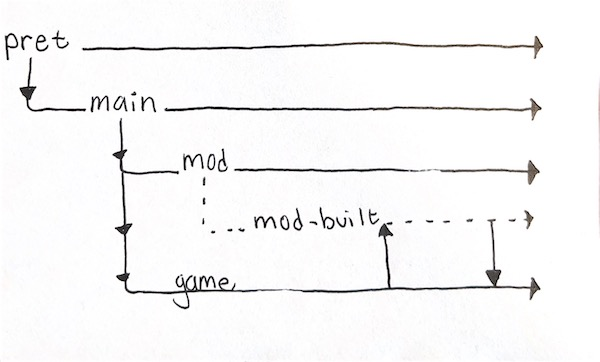

# 👋 Welcome to Pokémod Emerald

## 📖 Table of Contents

- [📝 Introduction](#-introduction)
- [📚 Installation](#-installation)
- [🪵 Branches](#-branches)

## 📝 Introduction

In the world of Pokémod Emerald, you find yourself alone, in the back of a moving truck, already knowing who you are. You're May. The daughter of Norman, the gym leader of Petalburg City. Soon to be trainer. Someday, champion.

## 📚 Installation

Please refer to the [Installation Guide](INSTALL.md) for detailed instructions on how to install Pokémod Emerald. Please note that you'll want to build from the `game` branch instead of `main`.

### Installing a specific mod

```bash
git remote add michelleeby https://github.com/Michelleeby/pokemodemerald.git
```

```bash
git pull michelleeby mod
```

For more information about the mods available, have a look at [closed Pull Requests](https://github.com/Michelleeby/pokemodemerald/pulls?q=is%3Apr+is%3Aclosed+label%3Amod).

## 🪵 Branches

Pokémod Emerald has two major branches: `main` and `game`. The `main` branch is in sync with pret's `master` branch, and is used as the base for all `mod` branches and the `game` branch.

The `game` branch is an aggregate of all `mod` branches. To merge a `mod` branch into `game`, first create a new branch from `mod`, `mod-built`, and merge `game` into `mod-built`. Then, merge `mod-built` into `game`. This method ensures that the `mod` branch stays in sync with `main`:


